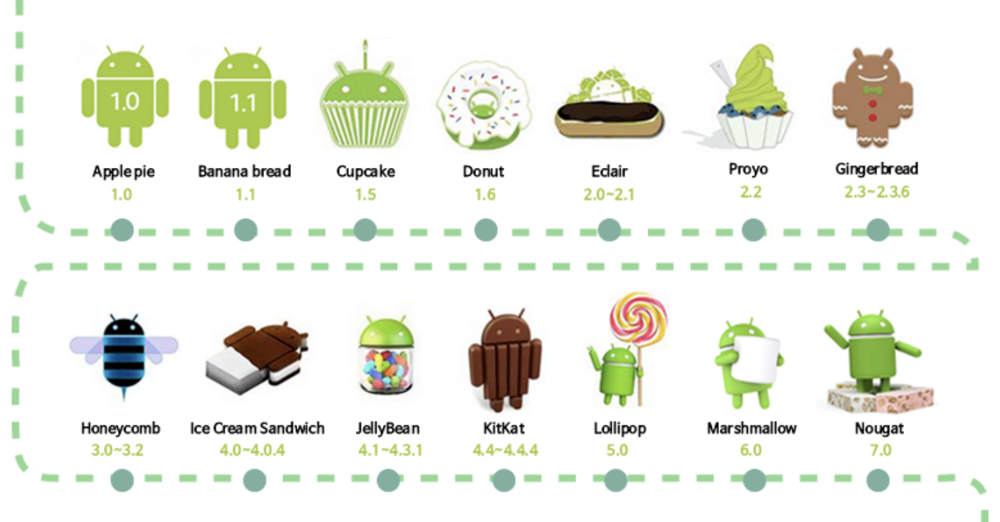

# 안드로이드스튜디오와 코틀린

## 1. 안드로이드란? 
안드로이드는 구글에서 만든 스마트폰용 운영체제입니다. 운영체제와 미들웨어, 사용자 인터페이스, 어플리케이션, MMS 서비스 등을 하나로 묶어 서비스를 제공하며 다양한 어플리케이션을 만들어 설치하면 실행될 수 있도록 구성된 어플리케이션 플랫폼이라고도 볼 수 있습니다. 많은 사람들이 iOS(애플 운영체제)에 견주어 스마트폰과 태블릿으로 안드로이드 운영체제를 사용하면서, 안드로이드는 세계 모바일 시장에서 가장 성공한 OS라는 평가를 받고있습니다. 안드로이드는 리눅스(Linux)를 기반으로 제작되었고 언어는 자바를 사용합니다. 

## 2. 안드로이드의 등장 
안드로이는 2005년 구글이 앤디 루빈이라는 사람이 설립한 안드로이드라는 회사를 인수하면서 시작합니다. 작은 소프트웨어 회사에 불과했던 안드로이드사는 구글이 인수하면서부터 운영체제 개발을 시작하면서 없어서는 안될  운영체제로 거듭나기 시작합니다. 2007년 11월에 안드로이드 플랫폼을 모바일 기기 운영체제로서 무료 공개한다고 발표하였습니다. 초창기 모바일 시장에서는 아이폰에 대한 대중의 반응은 뜨거웠기 때문에 안드로이드라는 OS를 보유하고 있는 구글은 큰 위협을 느꼈습니다. 이는 노키아나 삼성도 마찬가지였습니다. 그리하여 애플을 대항하는 반애플 집단이 형성되는데 그 집단의 이름이 OHA입니다. OHA는 리눅스 커널 2.6을 기반으로 한 그들의 첫 번째 모바일 기기 플랫폼 '안드로이드'를 발표하게 되었으며 여러가지 안드로이드의 장점과 많은 회사의 협력덕분에 현재의 독보적인 OS라는 위치까지 오르게됩니다.

- 오픈소스 : 안드로이드는 오픈소스를 기반으로 하고 있으며 아파치 2.0라이선스를 사용합니다.
- 완벽한 컴포넌트 : 안드로이드는 오픈소스임에도 불구하고 스마트폰을 위한 완벽한 컴포넌트들을 제공합니다. 핵심적인 커널 부분만 제공하고 다른 부분들은 개발자에게 맡기는 방식이 아니라 제공된 소스를 사용하면 스마트폰이라는 전화기가 그대로 만들어지므로 대부분의 개발자들은 그 위에 올라가는 앱만 만들면 됩니다.
- 높은 점유율 : 위에서 언급한 3가지를 주축으로 안드로이드는 빠르게 성장하여 애플의 IOS를 제치고 80%가 넘는 점유율을 가지게 되었으며 심지어 최근에는 Windows의 점유율마저 넘어섰다는 보도가 나오고 있습니다.
- 높은 이식성 : 안드로이드는 리눅스를 기반으로 높은 이식성을 가지고 있으며 새로운 하드웨어의 기능을 쉽게 연동할 수 있습니다. 모바일 뿐만이 아니라 태블릿, PMP 등의 각종 통신 기기에 사용될 수 있습니다. 나아가 가전 기기 심지어는 자동차까지도 적용할 수 있는 연동성을 갖추어 인베디드시스템의 새로운 패러다임을 제시하고 있습니다.
- 쉬운연동 : 안드로이드로 만든 앱은 다른 앱에서 제공하는 기능을 쉽게 사용할 수 있도록 만들어져 있습니다. 사진을 찍기 위해 단말의 사진 앱을 연동하면 카메라 미리보기 화면을 직접 만들지 않아도 됩니다.

- ApplePie : 안드로이드의 초창기 버전입니다.
- BannaBread : ApplePie를 조금 손 본것으로 크게 달라진 부분은 없었습니다.
- Cubcake : UI개선과 통화품질 개선 등 최적화작업이 많이 이루어져 안드로이드가 처음 주목받기 시작한 시기입니다.
- Donut : 안드로이드 마켓이 신설되고 네트워크기능을 추가하였으며 고 해상도를 지원합니다.
- Eclair : 속도가 더욱 향상되었으며 블루투스 기능이 처음으로 도입되었습니다.
- Proyo : Eclair보다 속도가 3배이상 향상되었으며 핫스팟기능이 도입되었습니다.
- GingerBread : UI를 좀 더 효율적으로 개선하였으며 배터리 효율이 강화되었습니다.
- HoneyComb : 휴대폰이 아닌 태블릿 전용 OS를 목적으로 출시되었으며 태블릿 화면에 맞는 UI와 기능이 도입되었습니다.
- IceCreamSandwic : 제가 처음으로 접한 OS이기도 합니다. 최적화 작업과 UI개선1 다양한 기능이 추가되었습니다.
- JellyBean : 터치스크린 반응속도 개선과 각종 UI기능 패치, 보안기능이 강화되었습니다.
- KitKat : 저사양폰에서도 버벅거림없이 구현이 가능할정도로 최적화작업이 완료되었습니다.
- LolliPop : UI가 좀 더 아기자기하고 이쁘게 개선되었습니다.
- MarshMallow : 지문인식기능이 탑재되었으며 데이터통신속도가 개선되었습니다.
- Nougat : 실행속도 개선을 비롯한 최적화 작업과 함께 3D그래픽 지원, 멀티윈도우 같은 다양한기능이 추가되었습니다.

## 1. 코틀린

(1) 코틀린이란?

- 코틀린은 자바 플랫폼에서 돌아가는 새로운 프로그래밍 언어이다.

- 코틀린의 주 목적은 자바가사용되고 있는 모든 용도에 적합하면서도 간결하고, 생산적이며 안전한 대체 언어를 제공하는 것이다. 

(2) 코틀린의 장점?
- 간결하고 실용적이다.
- 자바코드와의 상호운용이 가능하다.
- 성능은 자바와 비슷하다.
- 안정성이 높다. (데이터 타입 검사)

(3) 코틀린 vs 자바
- 코틀린이 구글의 공식언어로 채택 되어 지원하는 기능이 많으며 현재시장에서도 자바로 코딩된 어플들이 대부분 코틀린으로 바뀌고 있다. 
- 코드길이가 자바보다 눈에띄게 간결하고 사용법이 쉬워 아주 효율적이다.

  - 자바
    - 변수, 상수선언 String a, final String a
    - 세미콜론(;)을 사용해야함.
    - xml view 사용시 자바에서 재선언이 필요함.
    - 상업적으로 이용시 유료

  - 코틀린
    - 구글 안드로이드의 공식 언어로 채택됨.
    - 변수, 상수선언 var a, val a
    - 세미콜론 사용이 필요없음
    - xml view 사용시 xml id로 바로 사용가능
    - 전면 무료