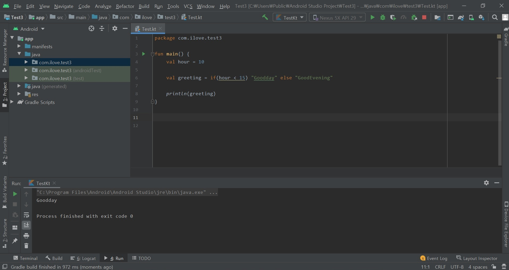

# 코틀린 문법(1)

## 1. 변수, 상수

C언어, JAVA 변수

- int, long -> 1, 2, 3 과 같은 상수를 의미
- double, float -> 1.0 , 1.23 , 1.45 과 같은 소수점 자리수를 의미
- string -> 문자열을 의미

코틀린 변수, 상수 선언 
- 코틀린은 C, C#, JAVA과 다르게 세미콜론(;)을 사용할 필요가 없다.(사용을 해도 무관함)

- 공통적으로 var(가변), val(불변) 이렇게 두가지가 쓰인다. 데이터 형식은 따로 지정을 할 수가 있다.
```kotlin
var a : Int = 0
var b : String = "kotlin"
```

- 코틀린은 데이터 형식이 확실할 경우 변수 선언 시에 데이터 형식을 정하지 않아도 된다.
```kotlin
var a = "kotlin" => 코틀린은 a가 String이라고 유추를 한다. 사용에 무관함
var b = 20 => Int, Float, Double이 될 수있다. 하지만 코틀린은 유추를 하여 한개의 형식으로 지정을 한다.

유추된 형식을 확인하는 방법
윈도우 : Shift + Ctrl + P
맥 : 화살표 + Ctrl + P
```
- 한개의 변수로 여러 데이터 형식을 사용하고 싶을 경우 Any를 사용하면 된다.
```kotlin
var a : Any = "kotlin"
a = 12  가능
```
- 변수를 선언할때는 일반적으로 소문자로 시작하여 두번째 단어부터는 대문자로 표시한다

  ex) androidStudio, kotlinLanguage

  <br>
  <br>

## 2. 배열, 범위, if, for, when, while
(1) 배열

- C언어 배열 선언 int score[4] = { 1, 2, 3, 4};

  Java 배열 선언 int [] = new int[]{ 1, 2, 3, 4};

  위와 같이 데이터 형식을 정해주고 초기화 방식이 까다롭지만 코틀린은 다르다.<br><br>
- 배열을 선언하는 방법에는 여러가지가 있지만 일반적으로 arrayOf()함수를 사용한다.
```kotlin
val array = arrayOf(1, 2, 3) 데이터 형식은 Array<Int>로 유추가 된다.
val array : Array<Int> = arrayOf(1, 2, 3) 동일
```
- 메모리 소모율을 줄이기 위해 아래와 같이 선언을 할 수도있다.
```kotlin
val array = intArrayOf(1, 2, 3) 
val array = shortArrayOf(1, 2, 3)
val array = longArrayOf(1, 2, 3)
```

(2) 범위

- 코틀린의 기능으로 변수, 상수에 범위를 설정할 수있다.
```kotlin
val inRange = 1..4    <- (1에서 4까지의 범위를 의미함)
val alphabet = 'a'..'z'
```

(3) <실습1> if문

- Java
```java
String a = "kotlin";
String b;

if(a == "kotlin") {
  b = "java";
} else {
  b = "C";
}
```
- 코틀린 if문은 C, Java와 동일하나 아래의 경우와 같이 사용할 수도있다.
```kotlin
val hour = 10
val greeting = if(hour < 15) "Goodday" else "GoodEvening"

println(greeting)
```




(4) <실습2> for문
- Java
```java
for(int i=0; i<10; i++) {
  System.println("java");
}
```
- Kotlin
```kotlin
for(i in 0..4) {
  println("kotlin")
}
```


(5) <실습3> when문
- C, Java의 switch문을 코틀린에서는 간단하게 완화시켜 사용을 한다.
- Java
```java
switch(i) {
  case 1:
      실행문;
      break;
  case 2:
      실행문;
      break;
  default:
      실행문;
}
```
- Kotlin
``` kotlin
val i = 2
when(i) {
  1 -> println("i=1")
  2 -> println("i=2")
  else -> println("i=?")
}
```


(6) <실습4> while문

- <실습4> while문은 C, Java의 while문과 동일하다.
```kotlin
var i = 0
while(i < 4) {
  println("kotlin")
  i++
}
```


<br>
<br>

## 3. Non-null, Nullable
(1) 엄격한 null 안정성
- 코틀린은 엄격하게 null을 구분한다. 그래서 null을 가질수 있는 타입과 가지면 안되는 타입의 선언 방식이 다르다.

  Nullable -> 데이터 형식에 ?을 더함
```kotlin
var a : String = null  에러
var a : String? = null
```

(2) 안전 호출 ?.
- 위에서 말했듯이 코틀린은 null을 허용할 수 있다. 그래서 언제든지 nullable인지 null인지 확인을 해야한다.
```kotlin
override fun onCreate(savedInstanceState : Bundle?) {
    val locked:Boolean = savedInstanceState.getBoolean(“locked”)  (에러) 
    val locked:Boolean? = savedInstanceState?.getBoolean(“locked”) 
}
```

(3) <실습5> 엘비스 연산자 ?:
```kotlin
var i = null
val locked:Boolean = i ?: false
println(locked)
```


- null이 아니면 함수의 결과값을 null이면 false를 반환 null을 허용안하니 변수에 ?가 없는 걸 확인가능

(4) Not-Null !!
- 어쩔수 없이 null이 허용안된 변수에 nullable 변수를 넣게 될 경우 !!를 사용하자.
```kotlin
var a : String? = "kotlin"
var b : String = "java"
b = a  (에러)
b = a!! (a는 절대 null이 아니다.)
```
- 만약 Not-Null을 써서 값을 할당 했는데 값이 null일 경우 컴파일 에러가 발생하니 유의하도록 하자.
