# 7. 안드로이드 스튜디오

## 1. 안드로이드 스튜디오

**1. AVD(Android Virtual Device)설치**
  - 안드로이드 운영체제를 탑재하고 있는 가상의 디바이스, 예뮬레이터라고도 불리며 실물의 디바이스가 없어도 안드로이드 어플을 실행 및 테스트 해 볼 수 있는 장점이 있다 
  
  - 상단 우측의 AVD Manager 클릭 
  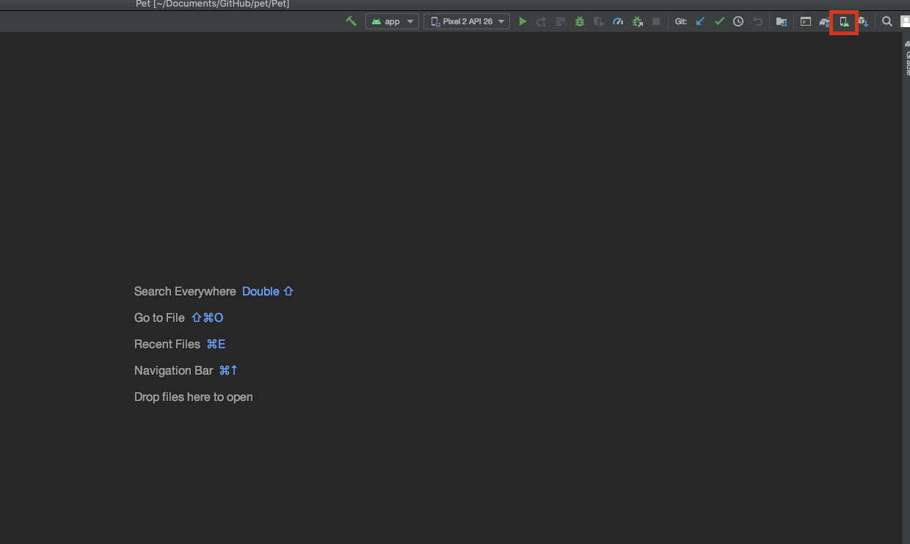ㄷ
  - Create Virtual Device 
  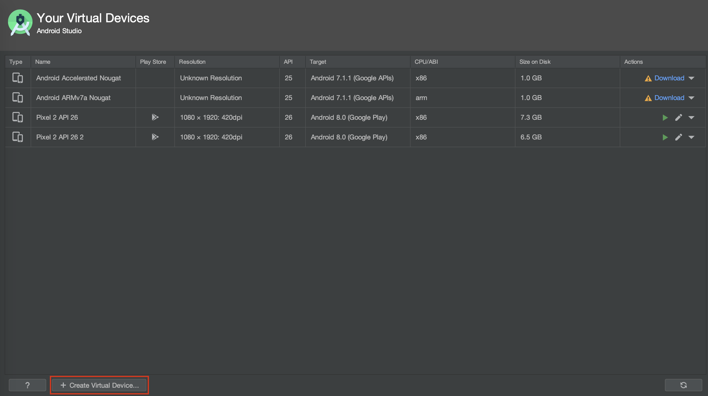
  - 디바이스 선택 
  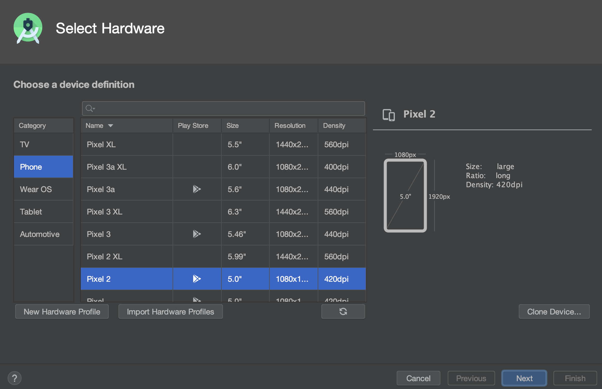
  - 안드로이드 버전 선택 및 다운로드 
  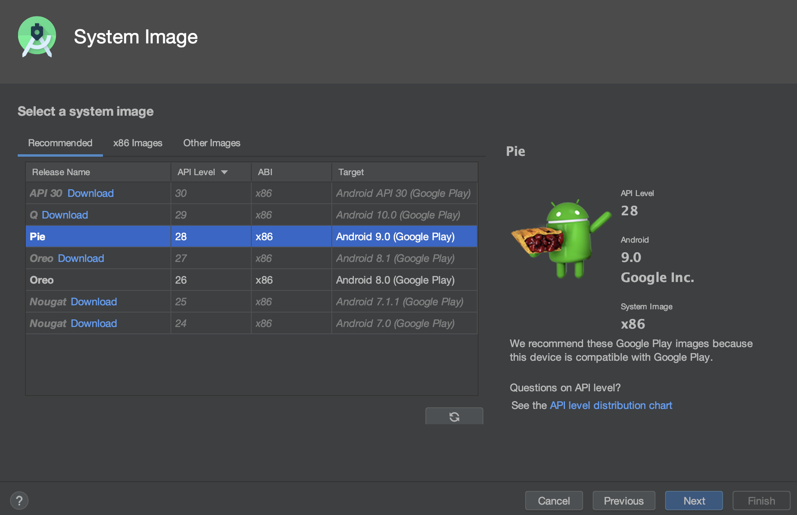
  - AVD 생성 
  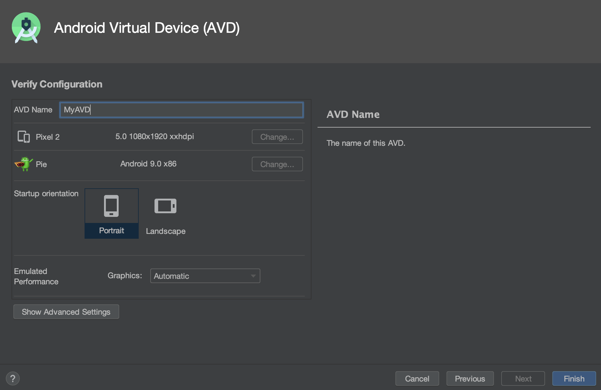
  ---
**2. 안드로이드 스튜디오의 폴더 구조 이해** 
  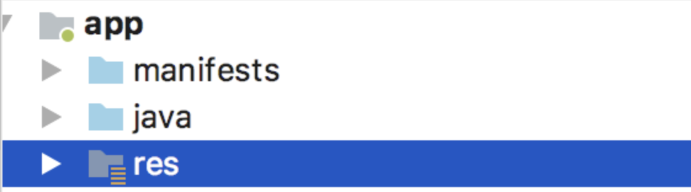
  - manifest : "AndroidManifest.xml"란 단 하나의 파일이 담겨져 있으며, 안드로이드의 컨트롤 타워라고 이해하면 된다. 안드로이드 어플리케이션을 구동하는데 필요한 설정값을 관리해주는 곳이다. 
  - java : 클래스를 관리하는 폴더이다. 
  - res : Resource 폴더로 UI와 관련된 파일과 디자인 리소스, 문자열 리소스를 담고 있는 폴더이다.  
  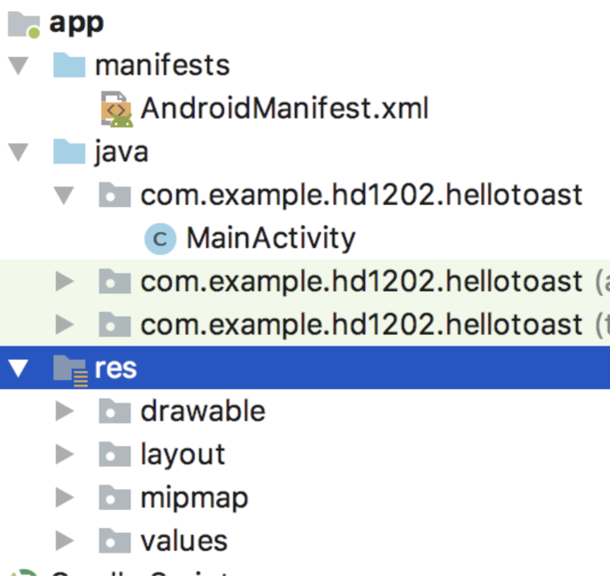
  - 안드로이드 스튜디오에서는 폴더와 패키지라는 용어를 동일하게 사용하고 있다. 때문에 Project 안에 있는 폴더를 지칭할때 '패키지'라는 용어를 사용하겠다(보다 일반적 표현)
  "안드로이드app 프로젝트 구조는 크게 manifest와 java, resouce, Gradle 패키지로 이루어 져있다."
  - AndroidManifest.xml 
  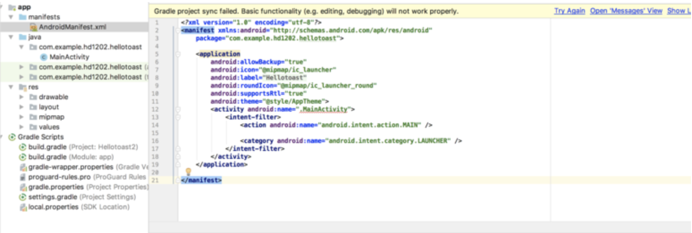
  - 크게 application이 있고 그 안에 activity가 존재한다.  
    간단하게 안드로이드 프로젝트는 'Application'위에 'Activity'가 실행되는 구조이다 
    <u>manifest : package = "com.example.hd1202.hellotoast</u> 
    application :     
  * icon ="mipmap/ic_launcher" - mipmap 폴더 아래에 있는 ic_launcher 라는 파일을 앱 아이콘으로 설정한다 .
    * label = "Hellotoast" - 아이콘에 표시될 앱 이름은 "hellotoast라고 한다.
    * theme = "@style/AppTheme" - 이 어플리케이션에 적용된 테마는 apptheme이다. 
      3~6. activity , intentfilter, action, category
      이 부분 역시 MainActivity가 생설될 때 세트로 추가되는 부분이다(프로젝트 생성시 자동) 
      
  - java 패키지에는 자바언어를 이용해 안드로이드 프로그래밍을 한다고 할 수 있는 부분은 이 패키지내에 코드(파일명.java or kt 형식의 파일)를 만들고 수정하는 일을 지칭한다고 보면 된다. 우리의 앱이 작동하는 방식에 대해 정의하는 java 코드들이 모두 이 곳에 들어있다. 
  * MainActivity 
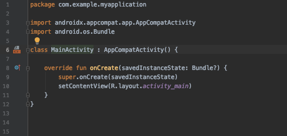
  다음과 같이 default가 정의되어서 나온다. 본문을 보면 onCreate()라는 메소드(함수) 하나가 정의되어있다. 
  <u>SetContentView(R.layout.activity_main)= layout 패키지 아래에 있는 activity_main.xml이라는 파일을 View로 연결한다.</u>  
  **[POINT]** **Activity 파일과 xml 파일은 언제나 한쌍이며 Activity파일에서 xml파일을 연결해준다**  
xml파일은 우리가 눈에 보이는 ui 를 구현하는 파일, 디자이너로 부터 받은 디자인을 구현할때 xml 파일을 만들면 되는 것. 
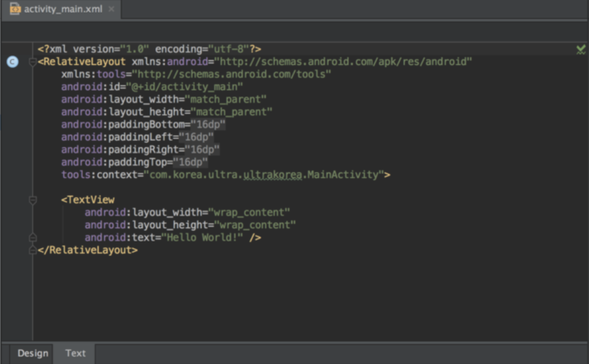
- activity_main.xml
Java/Kotlin과는 다른 포맷의 코드이며, androidManifest.xml과 같이 태그형식(<>)으로 구성된 xml 형식의 파일이다. 
화면에 Design Tap 또는 스플릿을 누르면 아래와 같은 디자인 UI가 제공이 된다. 
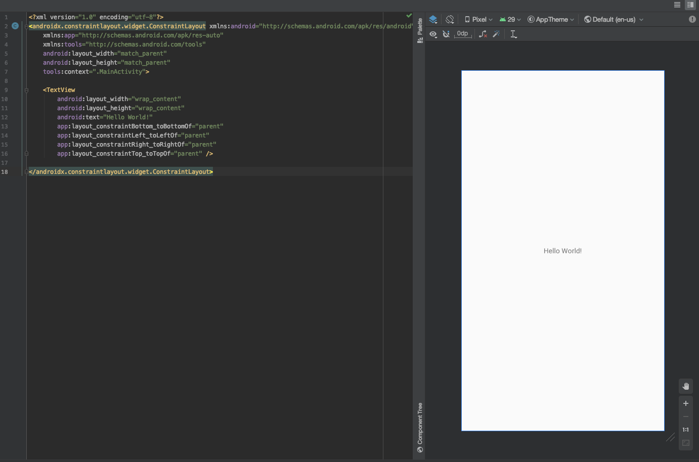
새로운 화면을 만들때마다
Activity를 만들고 그 파일안에서 xml파일을 연결해주면 된다.  

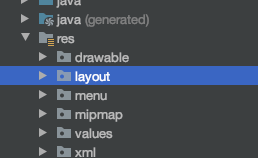
- activity_main_xml은 res패키지 아래에 layout 패키지 아래에 위치해있다. 
레이아웃과 관련한 화면 파일은 모두 이곳에 위치하게 된다. 
res 폴더에는 layout, drawable, mipmap, values 등이 있는데
layout 패키지에 있는 파일들이 디자인의 뼈대를 담당하는 부분이며, drawable, mipmap, values는 부수적인 저장소이다. 이미지파일이나 데이터들을 저장하고있는 곳이다. 
  * res/drawable - 이미지 파일 저장 패키지
    이미지파일을 담는다. 
  * res/mipmap - launcher 이미지(앱 아이콘) 저장 패키지
  * res/value - 문자열, 색상값, 수치값, 스타일 저장 패키지
    - colors.xml 컬러값 저장 파일 
    - string.xml 문자열값 저장파일 
    - style.xml 스타일값 저장 파일   
- 안드로이드 프로젝트는 app과 Gradle Scripts 로 이루어져 있다.
- app은 manifests, java, res 패키지로 이루어져 있다.
- manifests는 프로젝트 설정에 관한 부분, java는 프로그래밍 구현 부분, res는 레이아웃과 이미지, 문자열 리소스등 UI를 관장하는 부분이다.
- 모든 안드로이드 프로젝트는 MainActivity를 기본적으로 갖고 있어야 하며 manifests/AndroidManifest.xml에서 설정해준다.
- 화면을 만들때는 Activity파일(java or kt 파일)과 xml파일을 쌍으로 만들어주고 Activity파일에서 xml파일을 연결해준다.