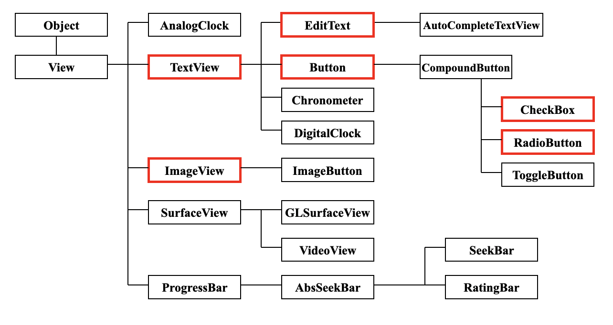
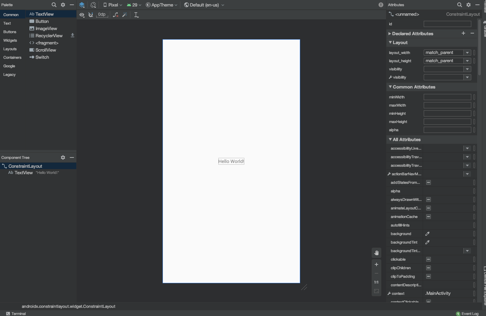
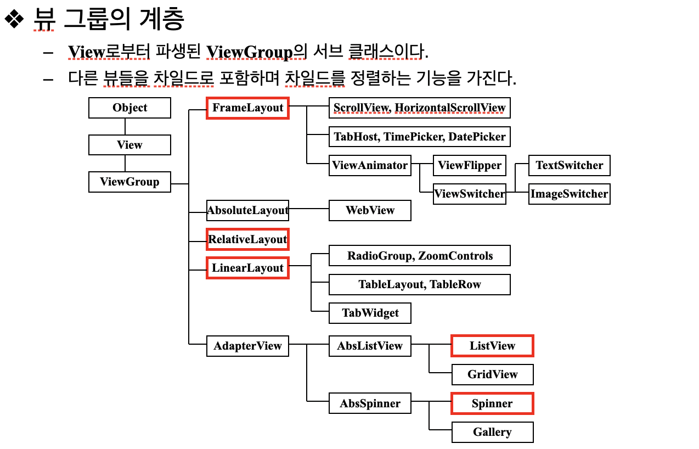
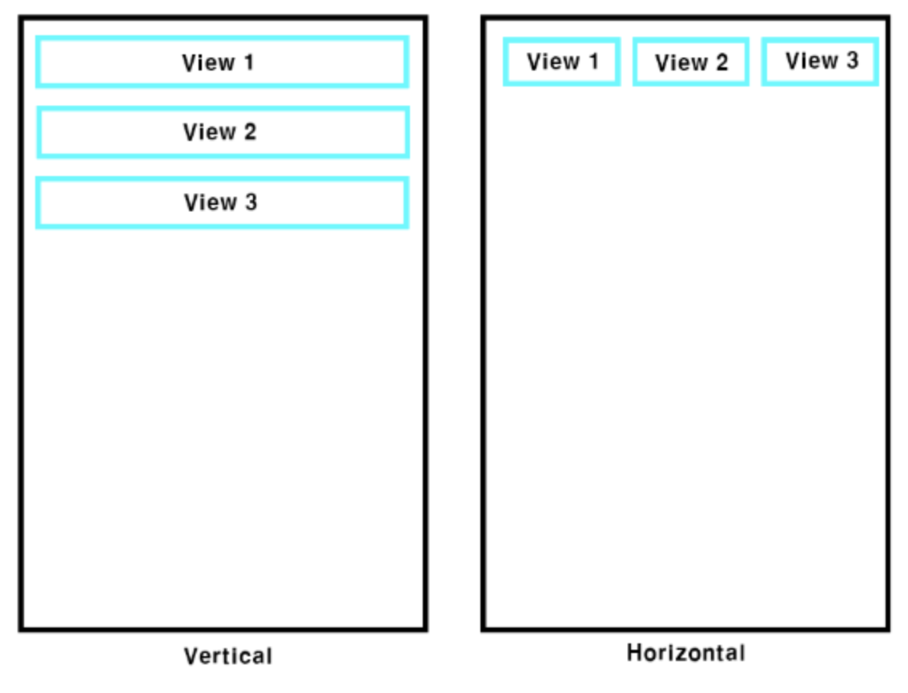
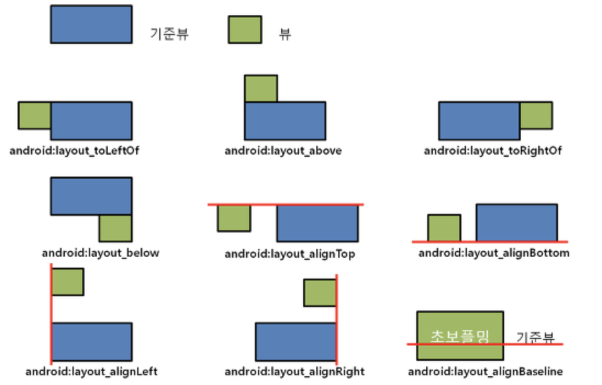
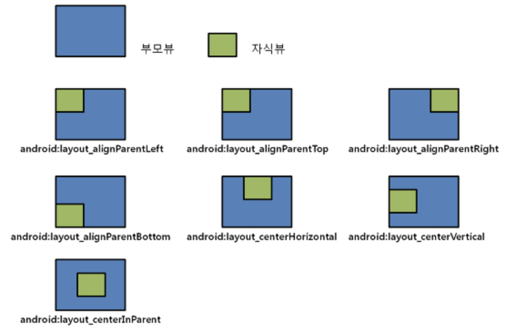
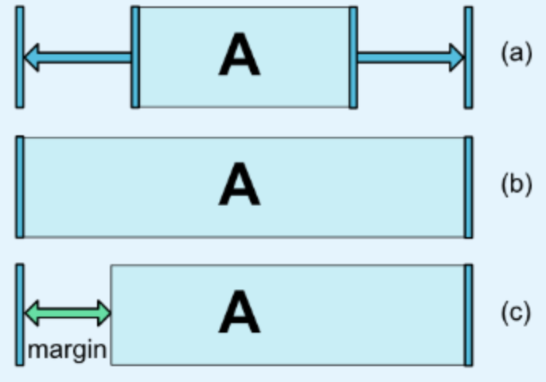
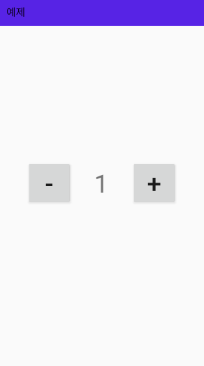

# 2. View
## 1. 뷰의 정의
- 뷰의 계층 
안드로이드 응용 프로그램의 화면을 구성하는 주요 단위인 액티비티는 화면에 직접적으로 보이지 않으며, 액티비티와 연결된 xml파일 안의 뷰가 사용자를 대면하는 실체이다. 
여러 개의 뷰가 모여 하나의 액티비티를 구성하고, 이러한 액티비티가 모여 하나의 응용 프로그램이 된다. 
- 뷰
  - 위젯 : 직접적으로 보이며 사용자 인터페이스를 구성한다
  - 뷰 그룹 : 뷰를 담는 컨테이너 역할을 하며, 이 부류의 클래스들을 레이아웃이라고 한다.

  - 뷰 그룹이면서도 위젯처럼 사용되기도 하는 클래스도 있으며, 특정 위젯을 상세히 알고 싶다면 그 슈퍼 클래스들부터 연구해야 한다. 
  - 서브 클래스는 슈퍼 클래스의 모든 속성을 상속받는다.  

## 2. Widget의 종류 
  - Button, EditText, TextView, ImageView 등 
  - 각각의 위젯들은 Attributes라는 속성값을 가지고있다   
   

## 3. Layout의 종류
   

## 4. Liner Layout
   - Linear Layout 내의 위젯들을 순서대로 배치하는 레이아웃
   - XML 문서에 나타나는 순서대로 뷰가 차곡차곡 배치됨 
  

## 5. Relative Layout
   - 위젯과 부모와의 위치 관계 또는 위젯끼리의 관계를 지정함으로써 뷰를 배치하는 레이아웃
   - 위젯 간의 상대적인 관계를 통해 배치할 장소를 정하는 레이아웃 

## 6. Constraint Layout
   - 복잡한 레이아웃을 단순한 계층구조를 이용하여 표현할 수 있는 ViewGroup
   - 형제 View들과의 관계를 정의해서 레이아웃을 구성하여, RelativeLayout과 비슷하지만 더 유연하고 다양하고 강력한 기능을 제공한다. 
  

## 7. 그 외
   - GridLayout
   - TableLayout
   - FrameLayout

## 8. 실습 예제
   - 갯수를 표시하고 조정할 수 있는 화면을 만드시오 또한 각 요소들은 중앙에 배치 되어야함 
