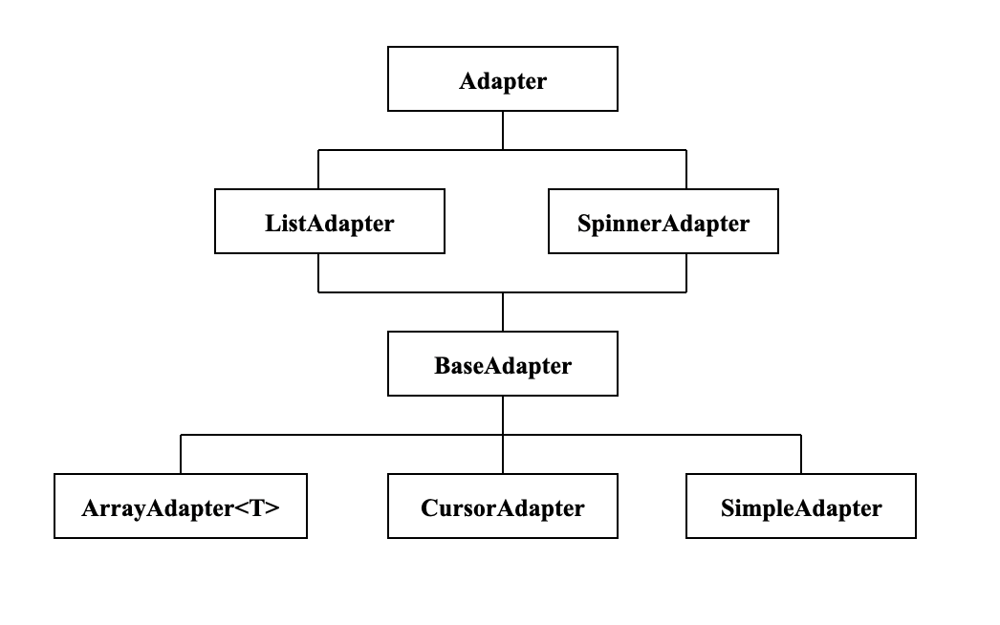
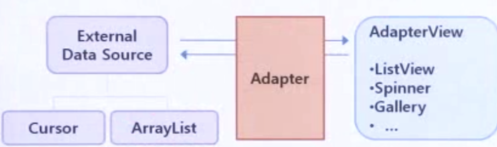

# 3. Adapter


## 1. 어댑터의 정의
- Adapter 인터페이스는 어댑터 뷰와 데이터간의 연결을 제공하고 항목의 집합을 관리하는 기본적인 메서드를 제공.<br>
최상위의 Adapter부터 파생된 인터페이스들<br>

    * ListAdapter : 리스트 뷰와 연결에 필요한 메서드를 정의<br>
    * SpinnerAdapter : Spinner와 연결에 필요한 메서드를 정의<br>
    * ArrayAdapter : 객체 배열이나 리소스에 정의된 배열로부터 데이터를 가져옴<br>
    * CursorAdapter : 데이터베이스로부터 데이터를 구함<br>
    * SimpleAdapter : XML 파일의 정적인 데이터를 원본으로 사용<br>



## 2. AdapterView
- AdapterView : Adapter 객체로부터 공급받은 자료를 화면에 표시 
  * ListView<br>
    복수 개의 항목들을 수직으로 표시하는 위젯<br>
    수직 스크롤을 지원하므로 항목의 개수가 아무리 많아도 다 표시할 수 있다.
    수평 스크롤은 지원하지 않음

  * 기타 (GridView, Spinner, Gallery 등)

- 즉 Adapter는 원본으로부터 얻은 데이터를 관리하며 Adapter View는 Adapter가 전달한 데이터를 화면에 표시하기만 한다.



```kotlin
class ProfileListAdapter extends BaseAdapter {
    private LayoutInflater _inflater;
    private ArrayList _profiles;
    private int _layout;

    public ProfileListAdapter(Context context, int layout, 
                                        ArrayList profiles) {
        _inflater = (LayoutInflater)context.getSystemService(
                                  Context.LAYOUT_INFLATER_SERVICE);
        _profiles = profiles;
        _layout = layout;
    }

    @Override
    public int getCount() {
        return _profiles.size();
    }

    @Override
    public String getItem(int pos) {
        return _profiles.get(pos).getName();
    }
 
    @Override
    public long getItemId(int pos) {
        return pos;
    }
 
    @Override 
    public View getView(int pos, View convertView, ViewGroup parent) {
        if(convertView == null) {
            convertView = _inflater.inflate(_layout, parent, false);
        }
  
        Profile profile = _profiles.get(pos);
  
        ImageView photo = (ImageView)convertView.findViewById(R.id.photo);
        photo.setImageResource(profile.getPhoto());
  
        TextView name = (TextView)convertView.findViewById(R.id.name);
        name.setText(profile.getName());
  
        TextView telephone = (TextView)convertView.findViewById(R.id.telephone);
        telephone.setText(profile.getTelephone());
  
        return convertView;
    }
}
```