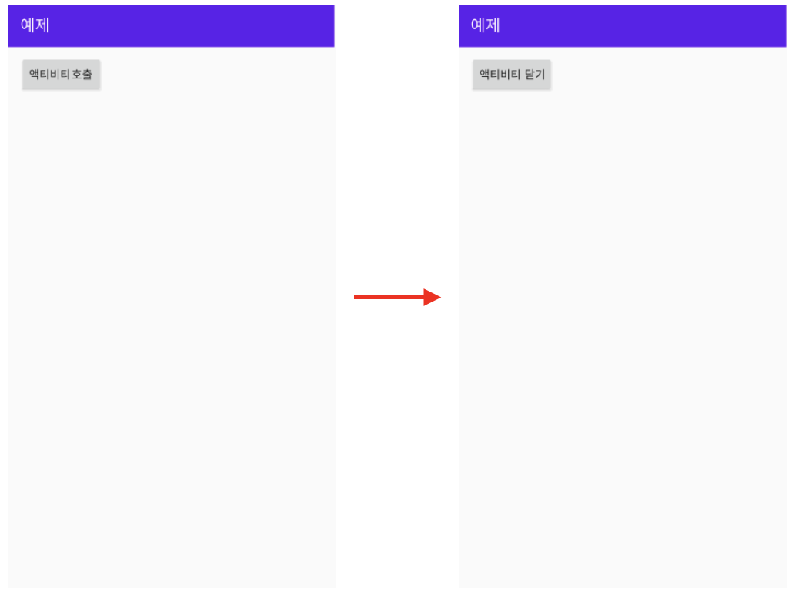
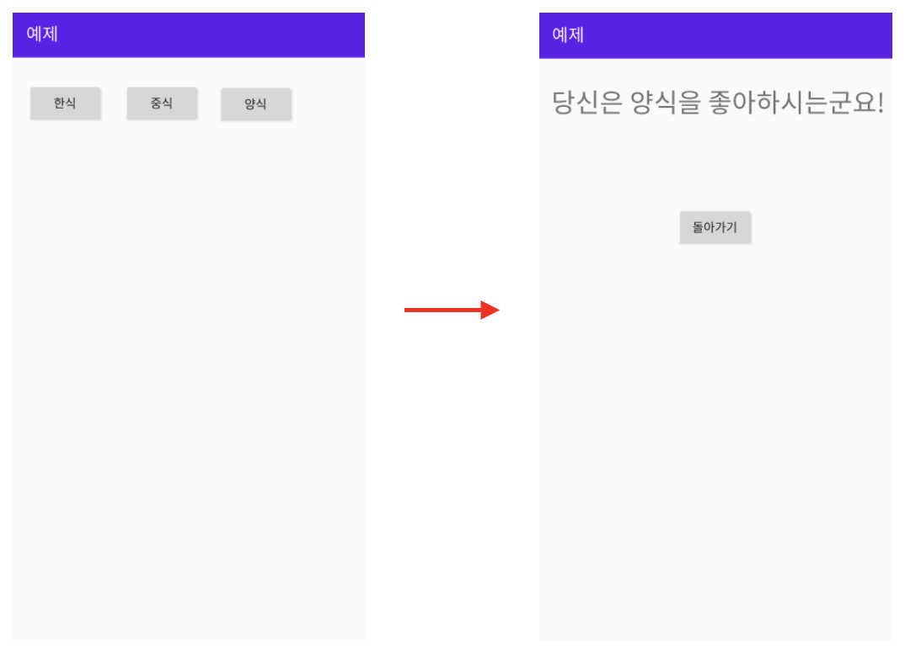

# 4. Intent
## 1. 화면 전환
- A Activity 에서 B Activity 호출 을 위한 Intent 활용
  * /res/layout 추가( B Activity Layout XML 파일 작성)
  * A Activity에서 Intent에서 B Activity 정의 및 호출
  * B Activity Class 작성
  * AndroidManifest.xml B Activity 등록

- MainActivity.kt
```kotlin
class MainActivity : AppCompatActivity() {

    override fun onCreate(savedInstanceState: Bundle?) {
        super.onCreate(savedInstanceState)
        setContentView(R.layout.activity_main)

        button1.setOnClickListener {
            val intent = Intent(this, SecondActivity::class.java)
            startActivity(intent)
        }
    }
}
```

- activitiy_main.xml
```xml
<?xml version="1.0" encoding="utf-8"?>
<androidx.constraintlayout.widget.ConstraintLayout
    xmlns:android="http://schemas.android.com/apk/res/android"
    xmlns:app="http://schemas.android.com/apk/res-auto"
    xmlns:tools="http://schemas.android.com/tools"
    android:layout_width="match_parent"
    android:layout_height="match_parent"
    tools:context=".MainActivity">

    <androidx.appcompat.widget.Toolbar
        android:id="@+id/toolbar"
        android:layout_width="409dp"
        android:layout_height="wrap_content"
        android:background="?attr/colorPrimary"
        android:minHeight="?attr/actionBarSize"
        android:theme="?attr/actionBarTheme"
        app:title="예제"
        tools:layout_editor_absoluteX="1dp"
        tools:layout_editor_absoluteY="-3dp"
        tools:ignore="MissingConstraints" />

    <Button
        android:id="@+id/button1"
        android:layout_width="wrap_content"
        android:layout_height="wrap_content"
        android:text="액티비티 호출"
        tools:layout_editor_absoluteX="16dp"
        tools:layout_editor_absoluteY="64dp"
        tools:ignore="MissingConstraints" />
</androidx.constraintlayout.widget.ConstraintLayout>
```


- SecondActivity.kt
```kotlin
class SecondActivity : AppCompatActivity() {

    override fun onCreate(savedInstanceState: Bundle?) {
        super.onCreate(savedInstanceState)
        setContentView(R.layout.activity_second)

        button2.setOnClickListener {
            finish()
        }
    }
}
```

- activitiy_second.xml
```xml
<?xml version="1.0" encoding="utf-8"?>
<androidx.constraintlayout.widget.ConstraintLayout
    xmlns:android="http://schemas.android.com/apk/res/android"
    xmlns:app="http://schemas.android.com/apk/res-auto"
    xmlns:tools="http://schemas.android.com/tools"
    android:layout_width="match_parent"
    android:layout_height="match_parent"
    tools:context=".MainActivity">

    <androidx.appcompat.widget.Toolbar
        android:id="@+id/toolbar"
        android:layout_width="409dp"
        android:layout_height="wrap_content"
        android:background="?attr/colorPrimary"
        android:minHeight="?attr/actionBarSize"
        android:theme="?attr/actionBarTheme"
        app:title="예제"
        tools:layout_editor_absoluteX="1dp"
        tools:layout_editor_absoluteY="-3dp"
        tools:ignore="MissingConstraints" />

    <Button
        android:id="@+id/button2"
        android:layout_width="wrap_content"
        android:layout_height="wrap_content"
        android:text="액티비티 닫기"
        tools:layout_editor_absoluteX="16dp"
        tools:layout_editor_absoluteY="64dp"
        tools:ignore="MissingConstraints" />
</androidx.constraintlayout.widget.ConstraintLayout>
```

## 2. Intent로 데이터 전달하기
- StartActivityforResult<br>
  Intent를 통해 액티비티를 전환할 때에 putExtra를 통해 String이나 Int 등 간단한 데이터를 전달할 수 있다.<br>
  putExtra(key: String, value: 간단한 데이터) 의 형식을 띤다.

```kotlin
val nextIntent = Intent(this, SecondActivity::class.java)
nextIntent.putExtra("name", "edgar")
startActivity(nextIntent)
```
<br>

- FirstActivity에서 putExtra 한 후, SecondActivity 에서 getStringExtra, getBooleanExtra 등 자료형에 맞는 메소드를 사용하여 데이터를 꺼내올 수 있다. 이때 null check 를 하지 않으면 0이나 null 등 잘못된 값을 꺼내올 수 있으므로, 해당 key가 전달할 값을 가지고 있는지 if hasExtra로 체크하는 것이 좋다.

```kotlin
/* SecondActivity.kt */

if (intent.hasExtra("name")) {
    textView.text = intent.getStringExtra("edgar")  
    /* "3대 중량"라는 이름의 key에 저장된 값이 있다면
       textView의 내용을 "3대 중량" key에서 꺼내온 값으로 바꾼다 */

} else {
    Toast.makeText(this, "저장된 이름이 없습니다", Toast.LENGTH_SHORT).show()
}
```
하나의 intent에 여러 개의 데이터를 putExtra 할 수 있다.


- 예제
  
