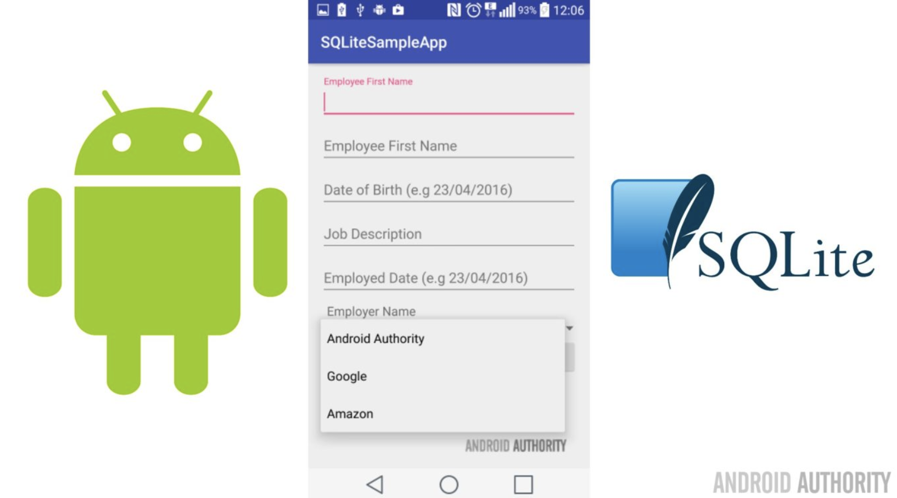

# 5. Database
## 1. SQLite를 이용한 데이터베이스 구축
- SQLite 란?<br>
    
  - SQLite는 2000년 Richard Hipp 박사에 의해 개발된 무료 DB엔진
  - 안드로이드 운영체제 차원에서 SQLite 라이브러리를 포함하고 있으며 별도의 설정 없이도 DB를 사용할 수 있다.
  - 안정적이고 용량이 작아 소규모의 데이터베이스에 적합
  - 아이폰, 심비안 등의 모바일 환경 및 휴대용 MP3등에 널리 사용
  - SQLite가 초경량급이기는 하지만 엄연한 관계형 데이터페이스 엔진이므로 데이터페이스에 대한 기본 개념과 표준 SQL구문에 대한 선행 학습이 필요하다.

- SQLiteOpenHelper  DB생성 및 Open 을 처리를 담당
- 생성자
  
- 메서드
  
- 안드로이드 스튜디오에 적용 시키기
- SWhschool DB 내에 TEST 테이블 설계
 create table TEST (
    name varchar(20) not null
    version varchar(20) not null);
    

```kotlin
public class MainActivity : Activity{
    
    private val dbName = "SWhschool"
    private val tableName = "TEST"
    
    private val names = arrayOf(
        "Marshmallow", "Nougat", "Oreo", "Pie", 
        "Android 10")
    
    private val phones = arrayOf(
        "Android 6.0.1", "Android 7.1", "Android 8.1", "Android 9", 
        "Android 10")
    var personList:ArrayList<HashMap<String, String>> = ArrayList<HashMap<String, String>>()

    var list:ListView? = null
    val TAG_NAME = "name"
    val TAG_PHONE = "version"
    var sampleDB:SQLiteDatabase? = null
    var adapter:ListAdapter? = null
    
    
    override public fun onCreate(savedInstanceState:Bundle) {
        super.onCreate(savedInstanceState)
        setContentView(R.layout.activity_main)
        list = findViewById(R.id.listView)
        
        try {
            sampleDB = this.openOrCreateDatabase(dbName, MODE_PRIVATE, null)
            //테이블이 존재하지 않으면 새로 생성합니다
            sampleDB.execSQL("CREATE TABLE IF NOT EXISTS " + tableName
                    + " (name VARCHAR(20), phone VARCHAR(20) );")
            //테이블이 존재하는 경우 기존 데이터를 지우기 위해서 사용합니다
            sampleDB.execSQL("DELETE FROM " + tableName  )
            //새로운 데이터를 테이블에 집어넣습니다
            for ( i in names.indecies){
                sampleDB.execSQL("INSERT INTO " + tableName
                        + " (name, phone)  Values ('" + names[i] + "', '" + phones[i]+"');")
            }
            sampleDB.close()
        } catch (se:SQLiteException) {
            Toast.makeText(getApplicationContext(),  
                           se.getMessage(), 
                           Toast.LENGTH_LONG).show()
            Log.e("", se.getMessage())
        }
        showList()        
    }
    
    
    private fun showList(){
        try {
            val ReadDB:SQLiteDatabase = this.openOrCreateDatabase(dbName, MODE_PRIVATE, null)

            //SELECT문을 사용하여 테이블에 있는 데이터를 가져옵니다
            val c:Cursor? = ReadDB.rawQuery("SELECT * FROM " + tableName, null);
            if (c != null) {
                if (c.moveToFirst()) {
                    do {
                        //테이블에서 두개의 컬럼값을 가져와서
                        val Name = c.getString(c.getColumnIndex("name"))
                        val Phone = c.getString(c.getColumnIndex("phone"))

                        //HashMap에 넣습니다.
                        val persons:HashMap<String,String> = HashMap<String,String>();

                        persons.put(TAG_NAME,Name);
                        persons.put(TAG_PHONE,Phone);

                        //ArrayList에 추가합니다
                        personList.add(persons);

                    } while (c.moveToNext());
                }
            }
            ReadDB.close();
            //새로운 apapter를 생성하여 데이터를 넣은 후
            adapter = SimpleAdapter(
                    this, personList, R.layout.list_item,
                    arraOf(TAG_NAME,TAG_PHONE),
                    arrayOf(R.id.name, R.id.phone),
            )
            //화면에 보여주기 위해 Listview에 연결합니다
            list.setAdapter(adapter);
        } catch (se:SQLiteException) {
            Toast.makeText(getApplicationContext(),  se.getMessage(), Toast.LENGTH_LONG).show();
            Log.e("",  se.getMessage());
        }
    }
}
```
- 생성 된 테이블<br>
  