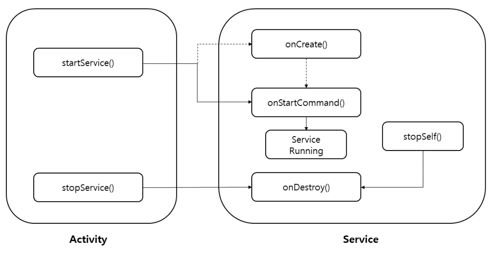
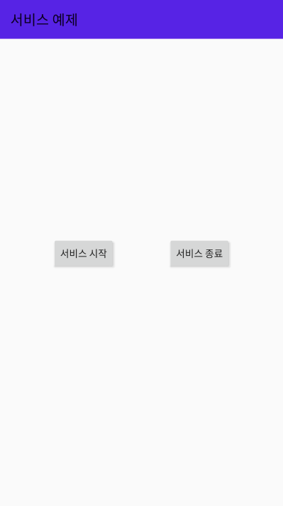

# 6. Service

## 1. 백그라운드 서비스
- 백그라운드 서비스 : 사용자에게 보이지 않는 백그라운드에서 작업을 수행한다. 시스템 리소스가 부족할 경우 강제 종료 될 수 있다.
- 액티비티와는 달리 별도의 디자인된 UI가 필요 없다.<br>


## 2. 백그라운드 서비스 사용법

### service 클래스 파일

```kotlin
class AppService : Service()
```
우선 서비스 클래스를 상속받는 클래스를 만들어 주면 구현이 필요한 메소드들이 생성 된다.<br><br>
  
- AndroidManifest.xml
```xml
<service 
    android:name=".AppServiceFile" />
```
앱의 manifest 파일에 서비스를 등록해야 한다. application 태그 안에 삽입.<br><br>

- service 시작<br>
  서비스는 activity나 application에서 시작할 수 있습니다
```kotlin
startService(Intent(context(),AppService::class.java))
```
context와 서비스 클래스 파일을 인자로 받아서 intent로 만든 다음에 startService 메소드로 서비스를 시작해주면 된다

- service 구현<br>

```kotlin
class AppService : Service() {
    override fun onBind(p0: Intent?): IBinder {
        throw UnsupportedOperationException("Not yet")
    }

    override fun onStartCommand(intent: Intent?, flags: Int, startId: Int): Int {
        callEvent()
        return Service.START_STICKY
    }
}
```
생성된 onBind와 onStartCommand를 오버라이딩 해준다<br>
callEvent() 메소드가 있는 부분에 원하는 내용을 넣게 되면 서비스가 시작되면서 작동하게 됨

## 3. 예제


- activity_main.xml
```xml
<?xml version="1.0" encoding="utf-8"?>
<androidx.constraintlayout.widget.ConstraintLayout
    xmlns:android="http://schemas.android.com/apk/res/android"
    xmlns:app="http://schemas.android.com/apk/res-auto"
    xmlns:tools="http://schemas.android.com/tools"
    android:layout_width="match_parent"
    android:layout_height="match_parent"
    tools:context=".MainActivity">

    <androidx.appcompat.widget.Toolbar
        android:id="@+id/toolbar"
        android:layout_width="0dp"
        android:layout_height="wrap_content"
        android:background="?attr/colorPrimary"
        android:minHeight="?attr/actionBarSize"
        android:theme="?attr/actionBarTheme"
        app:layout_constraintStart_toStartOf="parent"
        app:layout_constraintEnd_toEndOf="parent"
        app:title="서비스 예제"
        tools:ignore="MissingConstraints" />

    <Button
        android:id="@+id/startBtn"
        android:layout_width="wrap_content"
        android:layout_height="wrap_content"
        android:text="서비스 시작"
        app:layout_constraintBottom_toBottomOf="parent"
        app:layout_constraintEnd_toStartOf="@+id/endBtn"
        app:layout_constraintStart_toStartOf="parent"
        app:layout_constraintTop_toTopOf="parent"
        tools:ignore="MissingConstraints" />

    <Button
        android:id="@+id/endBtn"
        android:layout_width="wrap_content"
        android:layout_height="wrap_content"
        android:text="서비스 종료"
        app:layout_constraintTop_toTopOf="parent"
        app:layout_constraintBottom_toBottomOf="parent"
        app:layout_constraintEnd_toEndOf="parent"
        app:layout_constraintStart_toEndOf="@id/startBtn"
        tools:ignore="MissingConstraints" />

</androidx.constraintlayout.widget.ConstraintLayout>
```

- myService.kt
```kotlin
package com.example.myapplication

import android.app.Service
import android.content.Intent
import android.media.MediaPlayer
import android.os.IBinder
import android.util.Log

class myService : Service() {

    var mp : MediaPlayer? = null

    override fun onBind(intent: Intent?): IBinder? {
        return null
    }
    override fun onCreate() {
        super.onCreate()
        Log.d("test", "서비스의 onCreate")
        mp = MediaPlayer.create(this, R.raw.chacha)
        mp?.setLooping(false) // 반복재생
    }

    override fun onStartCommand(intent: Intent?, flags: Int, startId: Int): Int { // 서비스가 호출될 때마다 실행
        Log.d("test", "서비스의 onStartCommand")
        mp?.start() // 노래 시작
        return super.onStartCommand(intent, flags, startId)
    }

    override fun onDestroy() {
        super.onDestroy()
        mp?.stop()
        Log.d("test", "서비스의 onDestroy")
    }
}
```
- MainActivity.kt
```kotlin
package com.example.myapplication

import android.content.Intent
import androidx.appcompat.app.AppCompatActivity
import android.os.Bundle
import kotlinx.android.synthetic.main.activity_main.*

class MainActivity : AppCompatActivity() {

    override fun onCreate(savedInstanceState: Bundle?) {
        super.onCreate(savedInstanceState)
        setContentView(R.layout.activity_main)

        startBtn.setOnClickListener{
            val intent = Intent(this, myService::class.java)
            startService(intent)
        }

        endBtn.setOnClickListener{
            val intent = Intent(this, myService::class.java)
            stopService(intent)
        }
    }
}
```