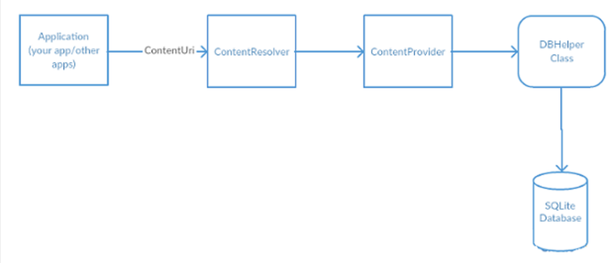

# 7.Content Provider
## 1. Content Provider의 정의
- 안드로이드 앱을 구성하는 네 가지의 기본 요소중 하나
- Content Provider는 어플리케이션 사이에서 Data를 공유하는 통로 역할을 한다.
- Content Provider가 안드로이드 시스템의 각종 설정값이나 DB에 접근하게 해 준다면 결과를 반환하는 브릿지 역할은 컨텐트 리졸버가 하게 됨
- Content Resolver는 Content Provider의 주소를 통해 데이터에 접근해서 결과를 가져온다
  

## 2. 안드로이드의  권한 요청
-  **정상 권한** : 앱을 사용하는 유저들의 개인정보를 위험에 빠뜨리지 않는 권한을 총칭.<br>
   Manifest에 정상 권한을 선언하면 시스템은 자동으로 권한을 부여하게 되며 앱 실행 시 권한 승인 여부를 묻지 않고 바로 접근 할 수 있음<br>ex) 인터넷 사용 등
-  **위험 권한** : 사용자의 기밀한 데이터에 대한 접근을 부여하는 것. Manifest에 위험권한을 선언 하면 앱을 사용하는 사용자에게 명시적인 권한 승인 여부를 확인받아야 함<br>ex) 카메라, 연락처, 마이크, 위치서비스 등

## 3. Content Provider 사용법

- 매니페스트에 해당 데이터에 대한 권한 추가
- 프로바이더로 데이터의 경로 얻기
- 권한 확인
- 권한 요청
- 사용 권한 요청 응답처리

## 4. 프로바이더로 사진 정보 얻기

### ContentProvider 를 통해서 사진정보를 가져오기 위해서는 파일 읽기, 쓰기에 대한 permission 을 얻어야 합니다.
 - AndroidMenifest.xml
```xml
<uses-permission android:name="android.permission.READ_EXTERNAL_STORAGE"/>
<uses-permission android:name="android.permission.WRITE_EXTERNAL_STORAGE"/>
```

### 프로바이더를 이용해 정보를 얻으려면 contentResolver 객체를 사용해 데이터를 얻을 수 있다

- ContentResolver : query(uri, projection, selection, selectionArgs, sortOrder)
  - uri : content://scheme 방식의 원하는 데이터를 가져오기 위한 정해진 주소
  - projection : 가져올 컬럼 이름 목록, null이면 모든 컬럼
  - selection : where 절에 해당하는 내용
  - selectionArgs : selection에서 ?로 표시한 곳에 들어갈 데이터
  - sortOrder : 정렬을 위한 order by 구문

 ### 외부 저장소에 저장된 모든 사진 최신순으로 정렬하여 Cusor 객체를 얻는 코드
```kotlin
//모든 사진 정보 가져오기
val cursor=contentResolver.query(MediaStore.Images.Media.EXTERNAL_CONTENT_URI,
            null,        //가져올 항목 배열
            null,        //조건
            null,  //조건
 
MediaStore.Images.ImageColumns.DATE_TAKEN+"DESC") //찍은 날짜 내림차순
```

### 권한 확인

- 실행중에 위험 권한이 필요한 작업을 수행할 때마다 권한이 있는지를 확인해야 합니다.
권한은 사용자가 앱 설정에서 언제든지 취소할 수 있기 때문입니다. 
권한이 있는지 확인하려면 ContextCompat.checkSelfPermission() 메소드를 사용합니다.
아래 코드는 앱이 외부 저장소 읽기 권한이 있는지를 확인합니다

```kotlin
  //권한이 부여되었는지 확인
        if (ContextCompat.checkSelfPermission(this, Manifest.permission.READ_EXTERNAL_STORAGE) != PackageManager.PERMISSION_GRANTED) {
            
            //권한이 허용되지 않음
            if (ActivityCompat.shouldShowRequestPermissionRationale(this, Manifest.permission.READ_EXTERNAL_STORAGE)) {
                //이전에 이미 권한이 거부되었을 때 설명
                alert(
                    "사진 정보를 얻으려면 외부 저장소 권한이 필수로 필요합니다",
                    "권한이 필요한 이유"
                ) {
                    yesButton {
                        //권한 요청
                        ActivityCompat.requestPermissions(
                            this@MainActivity,
                            arrayOf(Manifest.permission.READ_EXTERNAL_STORAGE),
                            REQUEST_READ_EXTERNAL_STORAGE
                        )
                    }
                    noButton { }
                }.show()
            } else {
                //권한요청
                ActivityCompat.requestPermissions(this, arrayOf(Manifest.permission.READ_EXTERNAL_STORAGE), REQUEST_READ_EXTERNAL_STORAGE)
            }
 
        } else {
            //권한이 이미 허용됨
            getAllPhotos()
        }
```
- shouldShowRequestPermissionRationale() 메소드는 사용자가 전에 권한 요청을 거부 했었는지를 반환합니다 . true 일경우 거부를 한적이 있는것입니다.
만약 사전에 거부했다면 권한이 왜 필요한 지에 대해서 별도의 메시지를 표시하고 다시 권한을 요청합니다.
만약 권한이 부여되지 않았다면 requestPermissions() 메소드를 사용하여 외부 저장소 읽기 권한을 요청합니다. 마지막 인자인 정수값에는 적당한 정수값을 넣어줍니다.
여기서는 REQUEST_READ_EXTERNAL_STORAGE=1000 을 주었습니다.

### 사용자 권한 요청 응답처리
```kotlin
override fun onRequestPermissionsResult(requestCode: Int, permissions: Array<out String>, grantResults: IntArray) {
        super.onRequestPermissionsResult(requestCode, permissions, grantResults)
        when(requestCode){
            REQUEST_READ_EXTERNAL_STORAGE->{
                if((grantResults.isNotEmpty()&& grantResults[0]==PackageManager.PERMISSION_GRANTED)){
                    //권한 허용됨
                    getAllPhotos()
                }else{
                    //권한 거부
                    toast("권한 거부됨")
                }
                return
            }
        }
    }
```

- 위에서 ActivityCompat.requestPermissions() 메소드를 호출하면 그결과는 
onRequestPermissionsResult() 메소드로 에서 처리합니다.
grantResults 배열에는 요청한 권한들의 결과가 전달됩니다. 지금은 하나의 권한만 요청되었 요청했기 때문에 0번 인덱스값만 확인합니다. 권한 승인되면 PERMISSION_GRNATED를 반환하고, 거부되면 PERMISSION_DENIED를 반환합니다.

### 권한 허용되었을때 처리
```kotlin
private fun getAllPhotos() {
        //모든 사진 정보 가져오기
        val cursor = contentResolver.query(
            MediaStore.Images.Media.EXTERNAL_CONTENT_URI,
            null,        //가져올 항목 배열
            null,        //조건
            null,  //조건
            MediaStore.Images.ImageColumns.DATE_TAKEN + "DESC"
        ) //찍은 날짜 내림차순
 
        if (cursor != null) {
            while (cursor.moveToNext()) { //사진의 경로가 저장된 데이터베이스의 컬럼명은 DATA 상수에 정의되어 있습니다.
                //getColumIndexOrThrow() 메소드를 사용하면 해당 컬럼이 몇 번째 인덱스 인지 알 수 있습니다. getString() 메소드에 그 인덱스를 전달하면 String으로 변환합니다.
                //이것이 uri 즉 사진이 저장된 위치의 경로가 됩니다.
                var uri=cursor.getString(cursor.getColumnIndexOrThrow(MediaStore.Images.Media.DATA)) 
                Log.d("MainActivity",uri)
            }
            cursor.close()
        }
    }
```