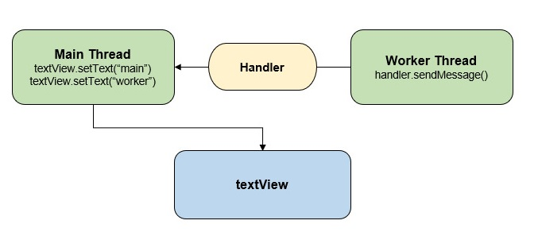

# 스레드와 핸들러

## 1. 스레드
스레드(Thread)란?
- 스레드는 하나의 프로그램 내에서 동작하는 '여러갈래의 작업 흐름'이다. 한마디로 하나의 프로그램에서 여러동작이 가능하도록 해주는 것이라 할 수있다.

예시
- 멜론을 사용한다고 가정을 해보자. 멜론 스트리밍은 노래를 핸드폰에 저장 시키지 않는다.
근데 어떻게 재생 버튼을 누름과 동시에 음악을 들을 수 있고 노래를 들으면서 다른 노래를 검색할 수 있는것인가?
스레드가 존재 하기 때문이다. 스레드가 여러개의 작업흐름을 만들어 다운로드 작업과 재생 작업 검색 작업을 모두 동시에 진행을 한다.

스레드
- 어플리케이션이 실행되면 스레드를 하나 생성하는데 이 스레드를 메인스레드라 부른다.(Main Thread)
메인스레드의 주요역할은 UI이다. 화면에 보여지는 구성요소들을 배치하는데에 주로 쓰인다.


  UI를 담당하는 메인스레드가 몇초이상 차단 될 경우에는 앱이 꺼지는 오류가 발생한다. 이런 상황을 발생하기 위해 UI작업이 아닌 보이지 않는 작업(통신, DB)을 수행하기 위해서는 다른 스레드를 생성하여 작업을 분담해야한다.

- 워크스레드가 작업을 마친후 정보를 메인스레드에게 정보를 전달하여 메인스레드는 화면에 표시하는 과정을 거친다.
- 메인스레드가 아닌 다른 스레드가 화면에 접근을 시도할경우 바로 앱이 꺼지는 오류가 발생하니 주의 하도록 할 것.

- 안드로이드는 위와 같이 메인스레드와 워크스레드를 분리하기 위해 방법을 제공하는데 바로 핸들러(Handler), 어싱크타스크(AsyncTask)이다.(밑에서 자세히 다룸)

<br>
<br>


## 2. 핸들러(etc. AsyncTask, runOnUiThread)
핸들러(Handler) 
- 위에서 설명 했듯이 워크스레드가 작업을 수행후 바로 UI를 건드리면 안되기 때문에 메인스레드로 정보를 전달한다고 했는데 그것을 도와주는 것이 핸들러이다. 네트워크 작업을 통한 정보를 UI표시할 때 주로 사용된다.


- 물론 핸들러를 이용하지 않고도 워크스레드 역할을 할수 있는 것들도 있다. 상황에 따라 사용방법이 천차만별이다.
  - 어싱크타스크(AsyncTask)
  - runOnUiThread()

어싱크타스크(AsyncTask) 
- 안드로이드에서 제공하는 기능이다. 워크스레드의 작업내용을 메인스레드로 전달한다.
차이점이 있다면 네트워크, DB와 같이 백엔드에서 이루어지는 작업중에도 중간중간 메인스레드로 정보를 전달하여 UI를 업데이트 시켜줄 수 있다.
```kotlin
inner class AsyncTask: android.os.AsyncTask<String, Long, ArrayList<Menu>>() {
        override fun onPreExecute() {
            super.onPreExecute()
            통신작업시작전 실행문(로딩화면을 주로 배치한다.)
        }

        override fun doInBackground(vararg p0: String?): ArrayList<Menu> {
            통신작업코드
        }

        override fun onProgressUpdate(vararg values: Long?) {
            super.onProgressUpdate(*values)
            통신작업중 UI를 제어 하고싶을때 사용하는 함수
        }

        override fun onPostExecute(result: ArrayList<Menu>?) {
            super.onPostExecute(result)
            통신작업이 종료되고 데이터를 메인스레드로 전달하여 UI를 제어한다.
        }


    }
```

runOnUiThread 
- 지금 작업을 수행하는 스레드가 메인 스레드라면 즉시 작업을 시작하고 메인 스레드가 아니라면 쓰레드 이벤트 큐에 쌓아두는 기능을 하는 게 runOnUiThread다.

 - 쉽게 설명하자면 워크스레드가 작업을 수행하고 메인스레드가 해야 할 작업을 한 곳에 쌓아두고 있다가 작업이 가능할 시에 바로하도록 하는 것이다.

 ```kotlin
runOnUiThread {
      통신작업결과를 기반으로 UI를 제어하는 코드를 선언하면된다.
}
 ```

