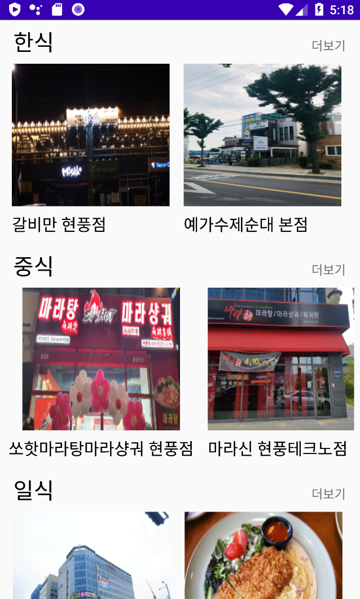
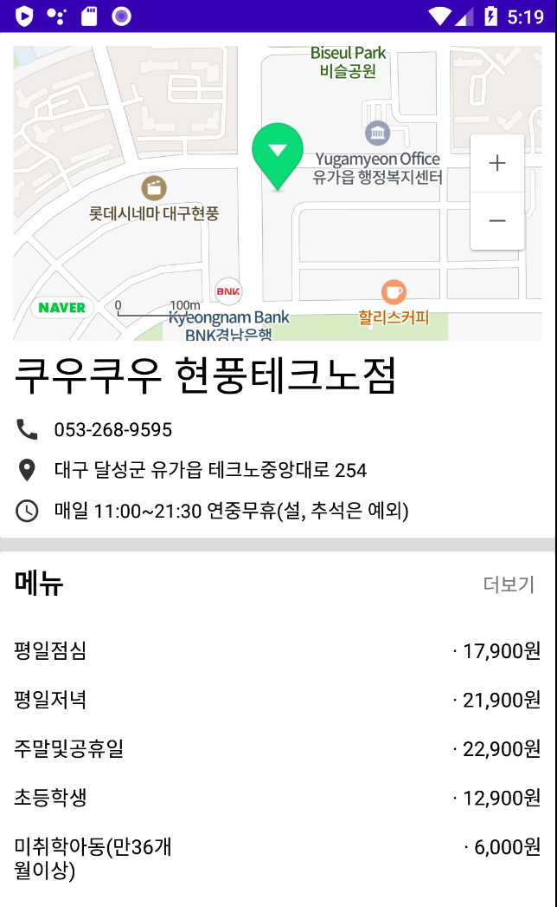

# 프로젝트 작성
## 네이버 API와 웹 크롤링을 이용한 맛집 검색 어플리케이션


## 1. 맛집 검색 어플리케이션
- 주변 식당 정보 Activity
  
  

- 식당 상세 정보 Activity



## 2. 네이버 API
```kotlin
class CafeVerticalAdapter(activity: Activity, val cafetype: ArrayList<String>) : RecyclerView.Adapter<CafeVerticalAdapter.ViewHolder>() {
    val clientId:String = ""
    val clientSecret:String = ""

    val mactivity: Activity = activity
    var dialog: Dialog? = null

    override fun getItemCount():Int{
        return cafetype.size
    }

    override fun onCreateViewHolder(parent: ViewGroup, viewType: Int): CafeVerticalAdapter.ViewHolder {
        val itemView : View = LayoutInflater.from(parent.context).inflate(R.layout.item_cafelist, parent, false)
        return ViewHolder(itemView)
    }

    override fun onBindViewHolder(holder: CafeVerticalAdapter.ViewHolder, position: Int) {
        fun fetchJson(vararg p0: String) {
            val searchtext = "테크노폴리스" + cafetype.get(position)
            val text:String = URLEncoder.encode(searchtext, "UTF-8")
            val apiURL = "https://store.naver.com/sogum/api/businesses?start=1&display=10&query=$text&sortingOrder=reviewCount"

            val url = URL(apiURL)

            val request = Request.Builder()
                .url(url)
                //.addHeader("X-Naver-Client-Id", clientId)
                //.addHeader("X-Naver-Client-Secret", clientSecret)
                .method("GET", null)
                .build()

            val client = OkHttpClient()
            client.newCall(request).enqueue(object: Callback {
                override fun onResponse(call: Call?, response: Response?) {
                    mactivity.runOnUiThread{
                        val body = response?.body()?.string()
                        println("Success to execute request : $body")

                        val gson = GsonBuilder().create()

                        val homefeed = gson.fromJson(body, Homefeed::class.java)

                        holder.CafeHorizontalRV.setHasFixedSize(true)
                        holder.CafeHorizontalRV.layoutManager = LinearLayoutManager(mactivity, RecyclerView.HORIZONTAL, false)
                        holder.CafeHorizontalRV.adapter = CafeteriaAdapter(mactivity!!,  homefeed)

                    }
                }

                override fun onFailure(call: Call?, e: IOException?) {
                    println("Failed to execute request")
                }
            })
        }
        holder.bindItems(cafetype.get(position))
        fetchJson(" ")

        holder.itemView.textView5.setOnClickListener {
            val intent = Intent(mactivity, CafeteriaActivity::class.java)
            intent.putExtra("cafetype", cafetype.get(position))
            mactivity.startActivity(intent)
        }
    }

    class ViewHolder(view: View) : RecyclerView.ViewHolder(view){
        val CafeHorizontalRV : RecyclerView = view.findViewById(R.id.CafeHorizontalRV)
        fun bindItems(data: String) {
            itemView.text_menutype.text = data
        }
    }
}
```

## 2. 웹 크롤링
```kotlin
class InformActivity : AppCompatActivity(), OnMapReadyCallback {
    val ncclientId:String = "4fk2n2jfrm"
    val ncclientSecret:String = "Ov8qSzvnvb4K3D8WGfh5ZP9yojd0e5UJvBJazuH1"

    companion object {
        var mapx: Double? = null
        var mapy: Double? = null
        var phone: String? = null
        var name: String? = null
        var id:String? = null
        var roadAddr:String? = null
        var menuList = ArrayList<Menu>()
        var options:String? = null
        var bizHourInfo:String? = null
        var tags:String? = null
        var dialog: Dialog? = null
    }

    override fun onCreate(savedInstanceState: Bundle?) {
        super.onCreate(savedInstanceState)
        setContentView(R.layout.activity_inform)


        var check:Boolean = true
        var sync = AsyncTask()

        var intent=intent
        name =intent.getStringExtra("name")
        mapx = intent.getStringExtra("x")!!.toDouble()
        mapy = intent.getStringExtra("y")!!.toDouble()
        phone = intent.getStringExtra("phone")
        id = intent.getStringExtra("id")
        roadAddr = intent.getStringExtra("roadAddr")
        options = intent.getStringExtra("options")
        bizHourInfo = intent.getStringExtra("bizHourInfo")
        tags = intent.getStringExtra("tags")


        sync.execute("")


        if(bizHourInfo == "" || bizHourInfo == null)
        {
            bizHourInfo = "정보없음"
        }

        if(options == "" || options == null)
        {
            options = "정보없음"
        }

        if(phone == "" || phone == null)
        {
            phone = "정보없음"
        }

        if("|" in bizHourInfo!!)
        {
            var index:Int =  bizHourInfo!!.indexOf("|")
            var timeOpenClose:String = bizHourInfo!!.substring(0, index-1)
            text_bizHourInfo.text = timeOpenClose + " ∨"
            var timeData:String = bizHourInfo!!.substring(index+2, bizHourInfo!!.length).replace(" | ", "\n")
            text_bizHourInfo.setOnClickListener{
                if(check == true)
                {
                    text_bizHourInfo.setText(timeOpenClose + " ∧\n" + timeData)

                    check = false
                }
                else
                {
                    text_bizHourInfo.text = timeOpenClose + " ∨"
                    check = true
                }
            }
        }
        else
        {
            text_bizHourInfo.text = bizHourInfo
        }


        text_inform_title.text = name
        text_roadaddr.text = roadAddr
        text_phone.text = phone

        val fm = supportFragmentManager
        val mapFragment = fm.findFragmentById(R.id.map) as MapFragment?
            ?: MapFragment.newInstance().also {
                fm.beginTransaction().add(R.id.map, it).commit()
            }
        mapFragment.getMapAsync(this)

        text_phone.setOnClickListener {
            val builder = AlertDialog.Builder(ContextThemeWrapper(this@InformActivity, R.style.Theme_AppCompat_Light_Dialog))
            builder.setTitle(name)
            builder.setMessage(phone)

            builder.setNegativeButton("통화") { dialog, id->
                val call = Intent(Intent.ACTION_DIAL, Uri.parse("tel:${phone}"))
                try {
                    startActivity(call)
                } catch (e: Exception) {
                    Log.d("test",e.toString())
                    e.printStackTrace()
                }
            }
            builder.setPositiveButton("취소") { dialog, id ->

            }
            builder.show()
        }


        text_viewmenu.setOnClickListener{
            var intent = Intent(this, MenuActivity::class.java)
            //intent.putParcelableArrayListExtra("menu", menu)
            intent.putExtra("menuList", menuList)
            startActivity(intent)
        }
    }

    override fun onMapReady(naverMap: NaverMap) {
        val cameraUpdate = CameraUpdate.scrollTo(LatLng(mapy!!,mapx!!))
        val zoomUpdate = CameraUpdate.zoomTo(18.0)
        naverMap.moveCamera(cameraUpdate)
        naverMap.moveCamera(zoomUpdate)

        val marker = Marker()
        marker.position = LatLng(mapy!!, mapx!!)
        marker.map = naverMap
    }

    inner class AsyncTask: android.os.AsyncTask<String, Long, ArrayList<Menu>>() {
        override fun onPreExecute() {
            super.onPreExecute()
            dialog = Dialog(this@InformActivity, R.style.loading_dialog_style)
            var pb = ProgressBar(this@InformActivity)

            dialog!!.addContentView(pb, LinearLayout.LayoutParams(LinearLayout.LayoutParams.WRAP_CONTENT, LinearLayout.LayoutParams.WRAP_CONTENT))
            dialog!!.show()
        }

        override fun doInBackground(vararg p0: String?): ArrayList<Menu> {
            val url = "https://store.naver.com/restaurants/detail?id=$id"
            try {
                val doc = Jsoup.connect(url).get()
                val menuData = doc.select("ul[class=list_menu]").select("li")
                //timeData = doc.select("div.biztime > span").text()
                menuList.clear()
                menuData.forEachIndexed { index, element ->
                    val menuName = element.select("li span[class=name]").text()
                    val menuPrice = element.select("li em[class=price]").text()
                    menuList?.add(Menu(menuName, menuPrice))
                }
            } catch (e: Exception) {
                e.printStackTrace()
            }
            return menuList!!
        }

        override fun onProgressUpdate(vararg values: Long?) {
            super.onProgressUpdate(*values)
        }

        override fun onPostExecute(result: ArrayList<Menu>?) {
            super.onPostExecute(result)

            if(menuList.size < 5)
            {
                menuRV.adapter = MenuPreviewAdapter(result!!, menuList.size-1)
                menuRV.setHasFixedSize(true)
                menuRV.layoutManager = LinearLayoutManager(this@InformActivity, RecyclerView.VERTICAL, false)
            }
            else
            {
                menuRV.adapter = MenuPreviewAdapter(result!!, 5)
                menuRV.setHasFixedSize(true)
                menuRV.layoutManager = LinearLayoutManager(this@InformActivity, RecyclerView.VERTICAL, false)
            }

            dialog!!.dismiss()
        }
    }
}
```