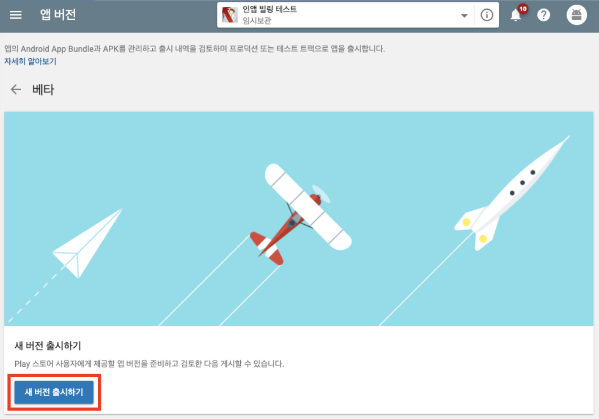

# 안드로이드 PlayStore 출시 루트, 라이선스 및 절차

## 1. 빌드하기
### 키스토어 생성
- 키스토어는 일종의 도장같은 파일 입니다. 이 것을 통해, 앱의 코드를 봉인 한다고 생각하시면 편하실 것 같습니다.
우선 메뉴를 통해, 코드에 사인하는 메뉴를 선택합니다. 

- 이 후 나오는 창에서는 APK 파일을 선택하도록 합니다. 그리고, next를 선택합니다.

- 그 다음 키스토어를 선택하는 창이 뜨는 데 우리는 키스토어가 없으므로, 키스토어를 생성하도록 합니다.
  

- 그러면 키스토어를 생성하는 창이 호출 됩니다.
키스토어는 APK를 사인할 수 있는 키가 잔뜩 들어 있는 파일 입니다. 앱은 처음에 출시할 때, 사인된 키로만 싸인해 올려야 하는데, 이 키가 여러개 들어 있어 키스토어 입니다. 주의 할 점은 구조상, 키스토어에 여러개의 키를 넣을 수 있지만, 키스토어에 1개의 키만 넣는 것이 좋습니다. 키스토어 하나가 망가지면, 모든 키들을 복구 할 방법이 없을 테니까요. 키스토어에 키스토어 하나가 좋습니다.

    아래와 같이 키스토어 생성창이 떴다면, 키스토어 패스워드와 그 패스워드 확인을 입력하고, 그아래 키 별칭(Alias)에 이키의 용도를 알기쉽게 적어줍니다. 그리고, 이키의 패스워드 와 그 패스워드 확인값을 잘 입력해 줍니다. Validdity는 이 키의 유효한 햇(year)수 입니다.

- 그럼 키스토어가 생성되고, 자동으로 생성했던 키스토어에서 필요한 정보들이 입력됩니다. 만약 기존의 키스토어를 사용하려면, Choose existing 버튼을 눌러 기존의 키 스토어를 선택하면됩니다. 자동으로 선택되어 있으므로, 바로 next를 눌러 다음 단계로 넘어 갑니다.

    결과물 출력 폴더와 빌드를 릴리즈, 디버그 방식 중 선택하는 옵션이 있습니다. debug모드는 해당 파일을 디버깅해 볼 수 있는 파일입니다. 우리는 출시예정이므로, release를 선택해야 합니다. 가장 아래 Signature Versions  라는 선택항목인데, v1을 선택해 줍니다. (v1 빼고 업로드 하면, no jar .... 이라는 오류가 뜹니다.)

- 그럼 빌드가 시작되고, 완료되면, 메시지 창이 떠 줍니다. 이 창에서 locate 를 선택하면, 빌드된 결과물이 있는 폴더로 이동합니다. (우 하단에 해당 다이얼로그가 표시됩니다.)

- 이 앱을 스마트폰으로 이동해 실행하면, 앱을 설치할 수 있습니다. (에뮬레이터는 드래그 & 드롭으로 복사 및 설치 가능)

## 2. 플레이 스토어에 애플리케이션 만들기.

- 이 앱을 플레이 스토어에 앱으로 등록하기 위해 플레이 스토어 내에도 애플리케이션을 만들어 주어야 합니다. 플레이스토어에 접속해, [애플리케이션 만들기] 버튼을 눌러 주도록 합니다. (저는 많은 앱들 중 리젝된 앱이 있어, 경고가 떠 있지만, 여러분은 그런 창이 아마도 없을 것 입니다.)

- 그리고, 호출되는 창에 값들을 적당히 입력하고, 만들기 버튼을 입력해 줍니다.
    그리고 나면 아래와 같이 스토어 등록정보를 입력하는 창이 나타납니다.  꼼꼼히 확인해서, 입력해 줍니다. 모든 입력사항을 입력하고, 임시 저장을 눌러 다음 페이지로 넘어 갑니다. 단 *콘텐츠 등급은 작성하지 않고 넘어 갑니다.

 

## 3. APK 파일 업로드.

- 플레이 콘솔의 왼쪽 메뉴의 앱 버전 버튼을 눌러 줍니다.
  

- 이제 앱버전 페이지가 보이는데 우리는 공개 트랙(베타) 항목에 apk 파일을 업로드 할 것 입니다. 해당 항목의 관리 버튼을 눌러 주도록 합니다.

- 베타 창에서 새 버전 출시하기 버튼을 눌러 새 버전을 출시하도록 합니다.

- 구글에서 앱 서명 키 관리 미 보호 옵션이 뜨는 데, 그냥 계속을 눌러 줍니다.

- 그럼 라이센스 관련 창이 뜨는데 언제나 처럼 다음으로 넘어 가줍니다. 그럼 그 아래 apk를 등록할 수 있는 항목이 활성화 됩니다. 여기서 중요한 것은 apk 파일을 업로드하는 것 입니다. 붉은 색으로 표시한 파일 찾아보기 버튼을 눌러 APK 파일을 추가한 뒤 그 아래 항목은 적당한 값들로 채워 넣습니다. 그 후 저장 버튼을 작성한 문서가 일단 저장됩니다. 그리고 검토 버튼이 활성화 되면, 검토 버튼을 눌러 다음 단계로 진행을 해 주도록 합니다.

- 저는 다음 화면으로 왔을 때 경고가 떴습니다. 일단 어떤 경고인지 확인해 보겠습니다. 경고 메시지 보기 버튼을 눌러 줍니다.

- 테스터가 한 명도 등록되지 않아 발생한 오류 입니다.

 

## 4. 테스터 설정하기.

- 구글 플레이 콘솔에서, 앱버전을 눌러 나온 창에서, 공개 트랙의 관리 버튼을 눌러 주도록 합니다.

- 그러면, 테스트 참여 대상 관리 항목이 나오는데, 테스트 방법 선택에 공개 베타 테스트를 선택하고, 최대 테스터 수를 1000명으로 합니다. 그리고 저장 버튼을 눌러 줍니다.

- 저장이 완료 되면, 그 아래 버전 수정 버튼을 눌러 다음 페이지로 이동합니다.

- 앱 버전 창이 나오면 검토 버튼을 눌러, 다음으로 이동하도록 합니다.

- 다음 창에서 확인해 보면, 앱 버전을 출시 준비가 되었지만, 아직 베타 출시 시작 버튼이 활성화 되지 않았습니다.

 

## 5. 콘텐츠 등급

왼쪽 메뉴의 콘텐츠 등급 버튼을 눌러 나온 페이지에 계속 버튼을 눌러 콘텐츠 등급을 작성합니다. 

- 아래와 같은 창이 뜨면, 이메일 주소를 입력하고, 앱 카테고리 선택 항목에서, 참고자료, 뉴스 또는 교육을 선택합니다. (물론 여러분이 필요에 의해 작성할 때는 상황에 맞는 카테고리를 선택하면 되겠습니다.)

- 설문지 창이 나오면, 적절한 항목을 선택한 뒤, 설문지 저장 버튼을 눌러 줍니다.

- 설문지 저장 버튼을 누르고, 저장이 완료되면, 등급계산 버튼이 활성화 되는 데, 이 버튼을 눌러 콘텐츠 등급을 산정하도록 합니다.

- 그러면, 주요 국가의 등급 레벨이 나오는데, 특별한 사항이 없다면, 등급 적용 버튼을 눌러, 등급을 적용합니다.

 

## 6. 가격 및 배포.

- 구글 플레이 콘솔 왼쪽 메뉴에 가격 및 배포 메뉴를 선택하고, 뜬 창에서, 적절한 항목을 선택하고, 임시 저장 버튼을 누릅니다. 추천 항목은 배포 방법 선택 무료, 국가는 모두 사용 가능, 주로 어린이를 대상으로 앱 항목은 아니오, 광고 포함 유무는 아니오, 콘텐츠 가이드 라인 체크, 미국 수출 법규 체크 입니다.

 

## 7. 베타 테스트 출시하기.

- 위의 사항들을 잘 마무리 한다면, 필수 항목에 다음과 같이 모두 녹색으로 체크 될 것 입니다.

- 그럼 왼쪽 메뉴의 앱 버전 메뉴를 선택하고, 공개 트랙의 관리 버튼을 눌러 줍니다.

- 다음 창의 출시되지 않은 버전이 있습니다. 항목에서 버전수정 버튼을 눌러 주도록합니다.

- 앱 버전 창이 뜨면 검토 버튼을 눌러 줍니다.

- 그럼 언제나 비활성화 상태에 있던 베타 출시 시작 버튼이 활성화 되어 있습니다. 이 버튼을 눌러 베타 출시를 시작하도록 합니다.

- 자 그럼 아래와 같이 베타 버전이 출시가 완료 되었습니다. 일단 상태는 게시 보류중 상태 입니다. 이 것은, 구글 플레이 측에서, 이 앱이 
게시가능한 앱인지 검토를 하고 있는 상태 입니다. 몇 분 혹은 몇 일간 이 상태가 계속 될 수 있습니다.

## 8. 베타 테스트 참여 주소 확인하기.

- 베타 버전 이라도 출시되면, 왼쪽 메뉴가 기존과 다르게 변경이 됩니다. 이 중 출시 관리 > 앱 버전 메뉴 항목을 선택해 줍니다.

- 다음 창에서, 테스트 참여 대상 관리 항목의 공개 베타 테스트 를 선택해 줍니다.

- 그러면, 접혀 있던 항목이 펴지며, 공개 베타 테스트 참여 주소를 확인할 수 있습니다.

- 위 주소로 접속하면 다음과 같은 테스트 참여 페이지를 볼 수 있습니다.

